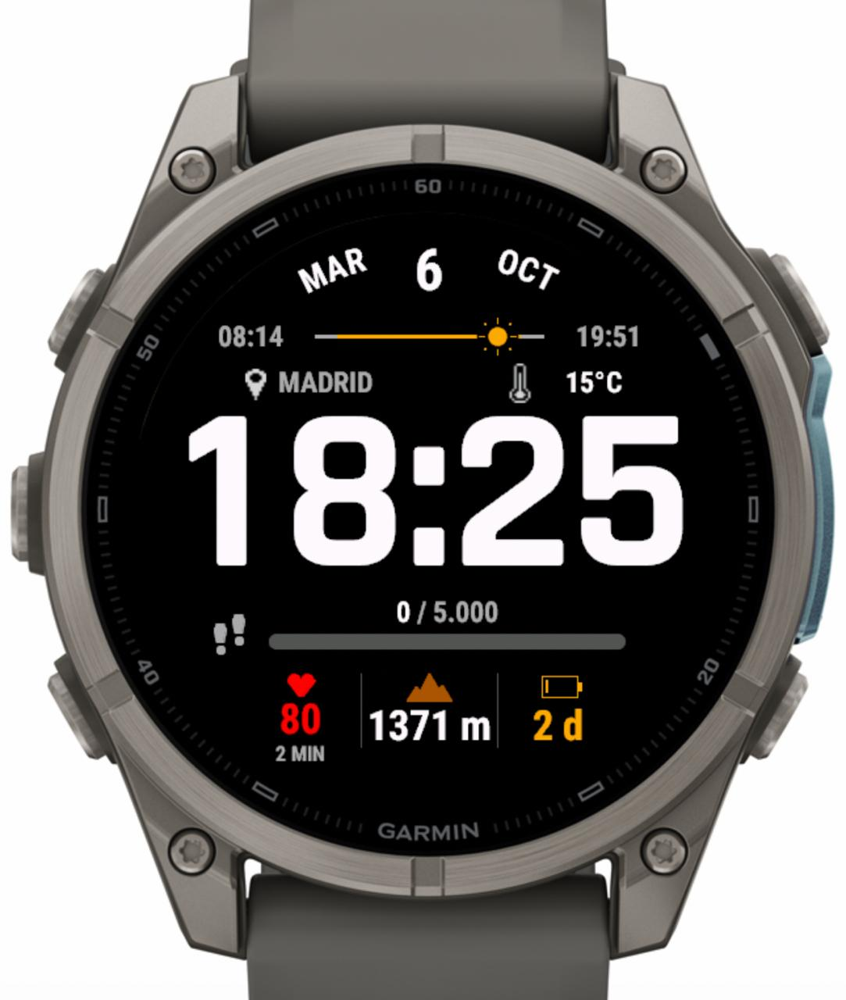

# Mountain Solar Watchface

Mountain Solar is a Garmin Connect IQ watch face written in Monkey C. It combines a large digital clock with weather, daylight progress, steps, heart rate, elevation, and battery information. The design started on the 47 mm fēnix 7 Solar and now scales across nine device profiles.



[More screenshots](screenshots/screenshot2.jpeg) · [Quick start](#quick-start) · [Device profiles](#device-profiles) · [Privacy](#privacy-and-connectivity)

## Features and Current Status

- Large 24-hour clock and a date in the watch's language.
- Temperature in °C and a cached city name for the weather observation's location.
- Sunrise/sunset bar with a sun during the day and a moon at night.
- Steps, daily goal, and an amber progress bar.
- Recent heart rate with sample age, elevation in meters, and estimated battery days with a percentage fallback.
- Resources for 36 watch languages, font fallbacks, and `--` for missing or expired data.

The latest recorded simulator validation passed 25 tests on each of the nine profiles (225 total), and the maintainer has confirmed their visual review. A signed release `.iq` package was also built successfully with SDK 9.2.0 on 6 October 2026, covering 15 device variants across those profiles.

Memory and battery-life measurements on physical watches remain pending. The AMOLED profile is experimental: a dedicated always-on display (AOD) presentation is still pending. Time format and units are currently fixed, with no user-configurable settings.

## Quick Start

The documented development setup is **macOS with Connect IQ SDK 9.2.0**. The application's minimum Connect IQ API version is **5.2.0**.

### Prerequisites

1. Install Java for the SDK and make `java` available in your shell. The bundled SDK documentation requires Java 11 or later.
2. Install [Garmin's Connect IQ SDK Manager](https://developer.garmin.com/connect-iq/sdk/) and SDK 9.2.0. In **Devices**, download `fenix7` to follow this example, or another profile listed below.
3. Install Python 3 to use [tools/ciq.py](tools/ciq.py). It uses only the Python standard library.
4. Provide a local signing key. With Garmin's Monkey C extension for VS Code, use **Monkey C: Generate a Developer Key** if you do not already have one. Save it as `developer_key` in the project root, or pass its path with `--key`.

Keep the key private and backed up. `developer_key` is ignored by Git and is not included in a fresh checkout. Updates to an existing store application must use its original signing key.

Run the following commands from the project root.

### Build

```sh
python3 tools/ciq.py build fenix7
```

This creates `bin/mountain-fenix7.prg`. Build several profiles by listing them after `build`:

```sh
python3 tools/ciq.py build fenix7 fenix7s fenix7x
```

The helper discovers the active SDK through SDK Manager's macOS configuration. You can select the SDK and key explicitly:

```sh
python3 tools/ciq.py build fenix7 --sdk /path/to/sdk --key /path/to/local-key
```

It also accepts the `CIQ_SDK` environment variable. The helper is designed for the macOS setup; on other platforms, adapt the SDK tool invocation to your environment.

### Run in the Simulator

Open the simulator using the active SDK on macOS:

```sh
export CIQ_SDK="$(cat "$HOME/Library/Application Support/Garmin/ConnectIQ/current-sdk.cfg")"
"$CIQ_SDK/bin/connectiq"
```

Then, in another terminal at the project root:

```sh
python3 tools/ciq.py run fenix7
```

`run` rebuilds the selected profile before launching it. Stop the current app before switching profiles. VS Code's Monkey C extension is an alternative; its local launch configuration is not tracked in this repository.

### Install on a Physical Watch

Build for the watch's exact profile, connect it by USB, and copy the corresponding `bin/mountain-<profile>.prg` into `GARMIN/APPS`. Use an MTP client if your system requires one. Disconnect safely and select Mountain Solar on the watch.

A `.prg` is for a specific profile and local installation. A `.iq` packages the manifest's profiles for upload to Connect IQ.

## Device Profiles

These are the profiles currently declared in [manifest.xml](manifest.xml). Display information comes from the installed SDK device definitions.

| Profile | Display | Resolution |
| --- | --- | --- |
| `fenix7` | MIP | 260 × 260 |
| `fenix7s` | MIP | 240 × 240 |
| `fenix7x` | MIP | 280 × 280 |
| `fenix7pro` | MIP | 260 × 260 |
| `fenix7spro` | MIP | 240 × 240 |
| `fenix7xpro` | MIP | 280 × 280 |
| `fenix8solar47mm` | MIP | 260 × 260 |
| `fenix8solar51mm` | MIP | 280 × 280 |
| `fenix947mm` | AMOLED, experimental | 454 × 454 |

The installed `fenix947mm` definition covers the 47 and 51 mm fēnix 9. Passing builds and simulator tests do not certify physical-device performance or AOD support. Profiles absent from the manifest have not been included in the release package.

## Data Behavior

The watch face reads data already available through Garmin APIs. It does not start GPS or optical heart-rate sensing.

| Information | Source | Refresh policy |
| --- | --- | --- |
| Time, steps, and step goal | System time and ActivityMonitor | Once per minute |
| Date and localized labels | Gregorian calendar and language resources | On date or language changes; language checked each minute and when restoring the layout |
| Battery and estimated days | System stats | At startup, then every five minutes |
| Temperature and observation coordinates | Garmin Weather | At startup, then every five minutes; refreshed after a background city result |
| Heart rate and elevation | SensorHistory | At startup, then every five minutes |
| Sunrise and sunset | Garmin Weather solar calculations | Cached by date and rounded location; missing events retried every 15 minutes |
| City name | Local cache, then Nominatim for unknown locations | Background lookup only when needed |

Reading expiry is checked every minute. Weather observations older than two hours, heart-rate samples older than 15 minutes, and elevation samples older than 30 minutes are hidden. Missing permissions or data produce `--`; missing solar events produce `--:--`.

Weather coordinates may refer to a nearby station. The sun/moon position represents elapsed time within the daylight/nighttime interval; the moon does not indicate lunar phase. Solar labels use the watch's local time zone.

The watch language controls date abbreviations, short labels, and digit-group separators. City requests retain a Spanish language preference (`es`). Layout, fonts, and display text are cached between redraws; Garmin controls redraw cadence. See the [battery-efficiency specification](specs/battery-efficiency.md) for the detailed policy.

## Tests and Manual Checks

With the simulator open:

```sh
python3 tools/ciq.py test fenix7
```

This creates `bin/tests-fenix7.prg` and runs the test suite. The current suite contains 25 test functions covering solar intervals, city caching and retries, background scheduling, refresh intervals, layout/font fallbacks, and locale changes. List several profiles after `test` to run them sequentially.

The helper accepts `monkeydo` exit code 1 only when the final summary explicitly reports passing tests with no failures or errors. If a batch stalls while changing profiles, restart the simulator and test each profile separately.

For manual validation, check:

- Clipping, long city names and numbers, reached step goals, and spacing, especially on the 240 × 240 profiles.
- Language changes and readability, including accented, Cyrillic, Asian, and right-to-left text. Automated tests do not certify all 36 languages visually.
- Missing and expired readings, midnight, sunrise/sunset transitions, and return from low-power mode.
- Production memory usage and battery life on physical devices. Test drawing buffers do not represent production memory use.

In **Settings → Set Weather**, supply a recent observation with coordinates. Stop and rerun the watch face to read it immediately, or wait for its five-minute refresh. A new city also needs background execution and Internet connectivity; **Simulation → Background Events → Temporal Event** can trigger a pending lookup, subject to retry delays. Sensor-history fields require historical samples, which may not be created by changing an instantaneous sensor value.

The compiler currently warns about scaling the 48 × 48 launcher icon to 40 × 40 on MIP profiles and 65 × 65 on the AMOLED profile. These warnings do not prevent compilation.

## Export for Connect IQ

Install all manifest device profiles, make Java available, and set `CIQ_SDK` to the SDK directory as shown in the simulator setup. Then create a signed release package:

```sh
mkdir -p bin
"$CIQ_SDK/bin/monkeyc" -f monkey.jungle -e -r -w -l 1 \
  -o bin/mountainsolarwatchface.iq -y developer_key
```

Use your actual key path after `-y` if it is stored elsewhere. `-e` packages all declared profiles and `-r` enables release mode. The output is `bin/mountainsolarwatchface.iq`. Build artifacts under `bin/` are ignored by Git and must be generated locally.

If the macOS export aborts while initializing Java's AWT application, the release export has also been verified with headless Java:

```sh
JAVA_TOOL_OPTIONS="${JAVA_TOOL_OPTIONS:+$JAVA_TOOL_OPTIONS }-Djava.awt.headless=true" \
  "$CIQ_SDK/bin/monkeyc" -f monkey.jungle -e -r -w -l 1 \
  -o bin/mountainsolarwatchface.iq -y developer_key
```

Before public distribution, complete the outstanding device checks and the provider/privacy review described below. Generating a package does not publish the app.

## Privacy and Connectivity

An unknown weather location triggers an automatic background request to Nominatim/OpenStreetMap through Garmin Connect. It sends weather coordinates rounded to two decimal places, a Spanish language preference, and the application identifier. Rounding reduces precision but does not anonymize the location. Heart rate, elevation, steps, and battery are not sent to this service.

Up to eight recent locations and city names are stored on the watch, along with retry state. Saved cities work offline. Failed requests back off for 5, 15, 30, then 60 minutes. This version has no separate city-lookup switch or consent prompt.

Declared permissions are `SensorHistory`, `Positioning`, `Communications`, and `Background`. `Positioning` provides access to weather coordinates; the watch face does not request GPS acquisition.

Read the privacy policy in [English](PRIVACY.md) or [Spanish](PRIVACY.es.md). Before public distribution, publish an accessible policy URL and review consent and provider requirements. Public Nominatim usage and the ability to change providers remain items for release review.

City data © [OpenStreetMap contributors](https://www.openstreetmap.org/copyright), under the ODbL license, through [Nominatim](https://nominatim.org/). Its [usage policy](https://operations.osmfoundation.org/policies/nominatim/) applies.

## Project Structure

| Path | Purpose |
| --- | --- |
| [manifest.xml](manifest.xml), [monkey.jungle](monkey.jungle) | Device profiles, permissions, source paths, and localized resource mappings |
| [source/](source/) | Application and view, data provider, solar bar, city service, layout, fonts, and presentation caches |
| [resources/](resources/) | Icons and localized strings; font/settings directories are placeholders |
| [tests/](tests/) | Simulator unit tests and their Jungle configuration |
| [tools/](tools/) | Build/run/test helper and status-icon generation utility |
| [specs/](specs/) | Original design brief and battery-efficiency requirements |
| [screenshots/](screenshots/) | Visual references |
| `bin/` | Generated PRGs, test binaries, compiler intermediates, and release packages |

The [original watchface specification](specs/watchface-specification.md) records the initial single-device MVP brief. Some requirements have since changed, including device coverage and external city lookup; use this README and the implementation for current behavior. The [battery-efficiency specification](specs/battery-efficiency.md) documents refresh and caching decisions.

## Remaining Work

- Measure production memory and battery life on physical watches.
- Implement and validate AMOLED AOD, transitions, and luminance behavior.
- Review visual readability across all declared languages.
- Add configurable time format and units.
- Review public city-service usage, privacy requirements, and release assets before publication.
